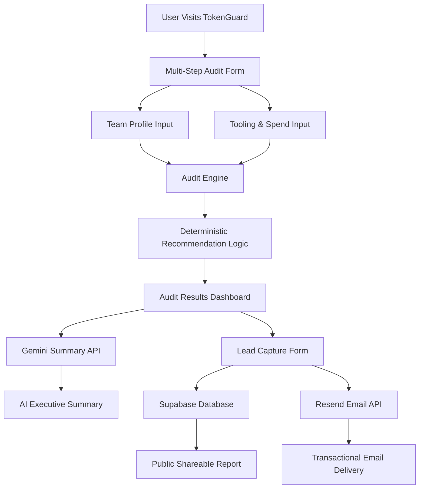

# ARCHITECTURE.md

# System Overview

TokenGuard is a full-stack AI infrastructure cost optimization platform designed to help startups and engineering teams audit their AI tooling spend.

The platform uses:

- deterministic pricing heuristics,
- structured pricing data,
- AI-generated executive summaries,
- and public shareable reporting workflows

to deliver transparent AI spend optimization recommendations.

---

# High-Level Architecture

---

# Data Flow

## 1. User Input Collection

Users enter:

- AI tools currently used,
- active plans,
- monthly spend,
- seat counts,
- team size,
- primary workflow type.

The onboarding flow persists state using browser localStorage so progress survives page refreshes.

---

## 2. Audit Engine Processing

The audit engine evaluates:

- plan-to-team-size fit,
- oversized enterprise subscriptions,
- redundant tooling overlap,
- unused seat allocation,
- API vs retail pricing opportunities.

This logic is intentionally deterministic and rule-based.

No LLM is used for financial calculations.

---

## 3. Audit Result Generation

The frontend renders:

- estimated monthly savings,
- annualized savings,
- optimization recommendations,
- contextual business reasoning.

Conditional UX adapts based on savings thresholds:

- high savings → Credex CTA,
- low savings → optimization monitoring messaging.

---

## 4. AI Summary Generation

Audit context is sent to the Gemini API through a secure Next.js API route.

Gemini generates:

- concise executive summaries,
- operational optimization narratives,
- founder-friendly explanations.

Fallback summaries are returned if the API fails.

---

## 5. Lead Capture & Persistence

Users optionally save reports by submitting:

- email,
- company,
- role.

The backend stores:

- audit inputs,
- summaries,
- savings data,
- shareable report IDs

inside Supabase PostgreSQL.

---

## 6. Public Report Generation

Each saved report receives:

- a UUID-based public URL,
- dynamic SEO metadata,
- Open Graph previews,
- Twitter card metadata.

Sensitive fields such as:

- email,
- company name

are intentionally excluded from public rendering.

---

# Stack Decisions

| Layer      | Technology               |
| ---------- | ------------------------ |
| Frontend   | Next.js 16               |
| UI         | Tailwind CSS + shadcn/ui |
| Animations | Framer Motion            |
| Backend    | Next.js API Routes       |
| Database   | Supabase PostgreSQL      |
| AI         | Gemini API               |
| Email      | Resend                   |
| Hosting    | Vercel                   |

---

# Why This Stack Was Chosen

## Next.js App Router

Chosen for:

- server/client rendering flexibility,
- dynamic metadata support,
- API route integration,
- deployment simplicity.

---

## Supabase

Chosen instead of a custom Express backend because:

- PostgreSQL support,
- instant APIs,
- fast iteration speed,
- simplified deployment,
- reduced backend maintenance.

---

## Gemini API

Selected because:

- strong free-tier availability,
- fast inference speeds,
- sufficient quality for executive summaries.

---

## Resend

Chosen because:

- minimal setup friction,
- excellent developer experience,
- transactional email focus,
- clean API integration.

---

# Scaling Considerations

Current architecture is optimized for:

- MVP velocity,
- rapid experimentation,
- low operational overhead.

If TokenGuard needed to support:

# 10,000+ audits/day

the following changes would likely be implemented:

---

## 1. Move Audit Engine to Dedicated Service

Currently:

- audit logic runs inline inside application flow.

Future:

- separate audit microservice,
- queue-based processing.

---

## 2. Add Caching Layer

Potential additions:

- Redis,
- edge caching,
- pricing snapshot caching.

---

## 3. Database Optimization

Potential improvements:

- indexing optimization,
- connection pooling,
- read replicas.

---

## 4. Background Email Queues

Transactional email delivery would move to:

- async queues,
- retry systems,
- event-driven processing.

---

## 5. Vendor Pricing Synchronization

Instead of manually maintained pricing data:

- automated pricing ingestion pipelines,
- scheduled sync jobs,
- pricing verification monitoring.

---

# Security & Abuse Protection

TokenGuard currently implements:

- honeypot-based spam protection,
- server-side API routing,
- environment variable isolation.

Future improvements could include:

- rate limiting,
- signed audit URLs,
- audit expiration,
- advanced anti-abuse protections.
