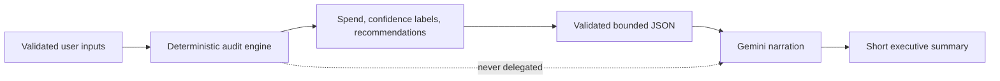

# AI summary boundary and prompt design

> **Runtime implementation:** [`app/api/generate-summary/route.ts`](app/api/generate-summary/route.ts)
>
> **Provider used in application code:** Google Gemini via `@google/generative-ai`
> **Model requested:** `gemini-2.5-flash`

TokenGuard uses generative AI for one narrow job: converting a completed deterministic audit into a short executive summary. It does **not** allow an LLM to choose vendors, calculate money, decide confidence, or alter the audit result.

This is a deliberate financial-safety boundary. A fluent explanation is useful; an untraceable financial recommendation is not.

## Design rule



The engine in [`lib/audit-engine.ts`](lib/audit-engine.ts) owns all currency arithmetic and recommendation confidence. The summary route receives the already-calculated `AuditResult`, validates it with Zod, and asks Gemini to describe it. The result screen continues to display the deterministic totals and recommendation details even if summary generation fails.

## API contract

### Endpoint

```txt
POST /api/generate-summary
Content-Type: application/json
```

### Accepted request body

```ts
{
  teamSize: number; // integer, 1–100,000
  primaryUseCase: "Coding" | "Writing" | "Research" | "Data Analysis" | "Mixed Workloads";
  auditResult: {
    totalMonthlySpend: number;
    estimatedAnnualSpend: number;
    estimatedMonthlySavings: number;
    reviewableMonthlySavings: number;
    recommendations: Array<{
      tool: string;
      severity: "low" | "medium" | "high";
      confidence: "verified" | "review";
      title: string;
      description: string;
      action: string;
      estimatedSavings: number;
    }>;
  };
}
```

The route uses `summaryRequestSchema`, which composes the shared `auditResultSchema` and `primaryUseCaseSchema`. It rejects malformed input with:

```json
{ "error": "Invalid audit summary request." }
```

and HTTP `400`.

### Successful response

```json
{ "summary": "A concise, founder-friendly explanation…" }
```

The provider output is trimmed and limited to 1,200 characters before returning it. There is no structured summary schema, citation mechanism, provider usage telemetry, or persistence of provider metadata in the current implementation.

## Data sent to Gemini

The route serializes a bounded audit context containing:

- team size and selected primary use case;
- calculated monthly and annual spend;
- verified and reviewable monthly-saving totals;
- each recommendation's confidence, title, description, action, and estimate.

It does **not** deliberately send lead-capture email, company, or role fields. However, recommendations can name a vendor, and any user-entered finance context that influenced the deterministic result may be reflected in totals or description text. Treat the provider call as an external data transfer and obtain the appropriate customer/privacy approval before using it with sensitive business data.

## Prompt intent

The effective instruction asks for a 100–120 word, professional, founder-friendly executive summary. Its important constraints are:

- focus on operational efficiency;
- mention verified savings separately from review-only opportunities;
- do not exaggerate savings;
- do not invent vendors, prices, or savings absent from the supplied JSON;
- remain concise.

The prompt supplies structured JSON rather than loose prose. That reduces ambiguity and narrows the model's job to transformation and explanation.

## Fallback behavior

The app remains usable without Gemini.

| Condition | Route behavior | User impact |
| --- | --- | --- |
| `GEMINI_API_KEY` is absent | Returns a deterministic summary built from the calculated totals and labels. | A precise summary is still shown; no model call occurs. |
| Request fails Zod validation | Returns HTTP `400` and an error object. | The current client does not render a dedicated summary error state, so this should be improved with explicit UI handling. |
| Gemini/provider runtime error | Returns a generic presentation fallback. | Audit results remain authoritative; the fallback is less specific and should not be used as financial evidence. |
| Provider returns long text | Trims and slices response to 1,200 characters. | Protects the response budget, but does not guarantee exactly 100–120 words. |
| Browser/network request fails | The client catches the error and leaves the summary state unchanged. | Results still render, but the summary can be blank. |

The deterministic missing-key fallback is intentionally more faithful than the generic unexpected-error fallback. A future improvement is to reuse the deterministic fallback for every non-validation failure so failure behavior cannot overstate a weak audit.

## Why no LLM financial reasoning?

| Problem with an LLM calculation | TokenGuard's countermeasure |
| --- | --- |
| Price and feature hallucinations | Prices come only from `lib/pricing-data.ts` or user invoices. |
| Non-repeatable answers | The same valid audit inputs produce the same deterministic result. |
| Unclear savings provenance | Every recommendation maps to a readable rule and calculation. |
| Unsafe vendor replacement advice | Plan-change and overlap suggestions are labeled review-only. |
| Prompt injection through user text | The route does not accept free-form narrative for audit logic; request shape is validated and bounded. |

Core design principle: **the model is a narrator, not an accountant.**

## Operational configuration

Only one environment variable is needed to enable the provider:

```dotenv
GEMINI_API_KEY=your-server-only-key
```

It is accessed inside a Route Handler, so it is not prefixed `NEXT_PUBLIC_` and must never be exposed in browser code or committed to `.env.local`. See [docs/operations.md](docs/operations.md) for deployment handling.

Although `openai` appears in `package.json`, the current runtime source imports and uses only the Gemini SDK. Do not describe OpenAI as an active integration unless the code changes.

### SDK lifecycle note

The current code uses `@google/generative-ai` and its `generateContent` API. Google’s current documentation also presents the newer `@google/genai` SDK and Interactions API for newer capabilities. That is a maintenance consideration, not a reason to make an untested swap: verify the target model, authentication method, request/response behavior, fallback paths, and deployment build before migrating the route.

## Reliability gaps and next steps

1. **Make fallback behavior uniformly deterministic.** Replace the generic provider-error text with the same calculated fallback used when no key exists.
2. **Add output validation.** Validate non-empty text and apply a word/character policy before returning it.
3. **Add rate limiting and abuse controls.** The route has request-shape validation but no rate limit, authentication, or per-IP quota.
4. **Add observability without leaking content.** Record provider latency, success/failure, model identifier, and a correlation ID—not the full audit payload by default.
5. **Add explicit UI states.** Display “summary unavailable; deterministic audit remains valid” for 4xx/network failures rather than allowing a blank panel.
6. **Write contract tests.** Test valid schema, invalid schema, missing key, provider failure, truncation, and the prohibition on untrusted free-form context.
7. **Define retention and consent.** Document what data is sent to the model, provider retention settings, and customer consent for each deployment.

## Review checklist

Before changing the summary prompt or provider:

- Does the model still receive only deterministic, validated audit data?
- Can it ever alter the numeric result or confidence label? It should not.
- Are new fields bounded by Zod and safe to send externally?
- Does every failure path produce a safe user-facing message?
- Is the new model ID verified against the provider's current official documentation?
- Are privacy, retention, rate-limit, and cost implications documented?
- Have the deterministic calculation tests passed independently of AI output?

## Related documents

- [docs/audit-methodology.md](docs/audit-methodology.md) — financial rules and confidence semantics.
- [PRICING_DATA.md](PRICING_DATA.md) — pricing snapshot and catalog maintenance.
- [ARCHITECTURE.md](ARCHITECTURE.md) — route placement and trust boundaries.
- [TESTS.md](TESTS.md) — present verification status and required future test coverage.
