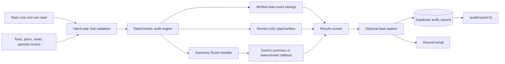

# TokenGuard

TokenGuard is a decision-support web app for reviewing a startup team's AI-tool subscription spend. A user enters team size, primary use case, tools, plans, seat counts, and (optionally) actual invoice subtotals. The app produces a deterministic audit, a clearly separated AI-written summary, and—when storage is configured—a shareable report.

It is deliberately **not** an automatic cancellation system or a token-level API-cost predictor. Its job is to identify safe, explainable review points and give a finance or engineering owner a practical next action.

## Project summary

> TokenGuard separates financial logic from generative AI. Pricing and savings are calculated in a typed, deterministic client-side engine using a small, versioned public-price catalog plus customer-provided invoice totals. Gemini only turns the already-calculated result into a readable executive summary. That separation makes the monetary claims reproducible, auditable, and safe to qualify as either *verified* or *requires review*.

## What the app does today

- Guides a user through team profile, tool selection, and review.
- Supports Cursor, GitHub Copilot, Claude, ChatGPT, Google AI / Gemini, Notion AI, Midjourney, Perplexity, Canva AI, and a generic **Other AI / API invoice** entry.
- Uses public USD list price × quantity (seats or paid accounts) when no positive invoice subtotal is supplied; a positive invoice subtotal takes precedence.
- Counts only the excess-seat check in the **verified monthly savings** total.
- Surfaces plan changes, annual commitments, invoice anomalies, and tool overlap as **reviewable opportunities** rather than guaranteed savings.
- Validates inputs with Zod, keeps valid draft state in `localStorage`, and rejects malformed saved sessions.
- Generates an executive summary through a Next.js Route Handler, with deterministic fallbacks if Gemini is not configured or fails.
- Saves an optional report to Supabase, creates a public report URL, and attempts delivery through Resend.

## What it intentionally does not claim

- It does not ingest vendor admin data, invoice line items, token counts, or real seat-activity data.
- It does not calculate API/model token costs; API and contracted costs are captured as a manual invoice total and receive guardrail advice only.
- It does not automatically cancel, downgrade, or consolidate a subscription.
- It does not include taxes, regional pricing, credits, negotiated discounts, add-ons, or usage overages unless the user includes them in the entered invoice subtotal.
- A reviewable total is a **gross, non-additive candidate amount**. A plan downgrade, annual commitment, and tool-consolidation recommendation can overlap and must not be summed as a forecast.

## Audit workflow



## Savings labels matter

| Label | How the current implementation derives it | How to use it |
| --- | --- | --- |
| **Verified monthly savings** | For a priced plan, `max(0, quantity - statedTeamSize) × publicPlanPrice`, capped by entered spend. It checks an entitlement count only; it does not prove a particular person is inactive. | Treat as a starting point for a vendor-roster check. |
| **Reviewable opportunity** | Possible premium-to-lower-plan change, small-team team-plan change, annual-billing alternative, coding/general-assistant overlap, or an invoice above base list price. | Validate feature needs, contracts, usage, data controls, and renewal terms before action. Never add it to the verified total. |
| **Invoice/contracted entry** | A quote-based or generic API entry requires a positive monthly invoice subtotal and receives no speculative saving. | Use it to establish spend visibility, then inspect vendor usage and budget controls. |

The detailed formulas, examples, and guardrails are in [the pricing reference](docs/PRICING_DATA.md) and [the audit methodology](docs/audit-methodology.md).

## Architecture at a glance

| Concern | Implementation |
| --- | --- |
| App framework | Next.js 16 App Router, React 19, TypeScript |
| Interactive audit | Client Component at `app/audit/page.tsx` with browser `localStorage` |
| Financial logic | `lib/audit-engine.ts`, backed by `lib/pricing-data.ts` |
| Runtime validation | Zod schemas in `lib/audit-validation.ts` |
| AI narration | `POST /api/generate-summary` using Gemini, with a deterministic fallback |
| Persistence | Supabase `audit_reports` table via the public Supabase client |
| Email | `POST /api/send-email` using Resend |
| Public report | Server-rendered dynamic route at `/audit/report/[id]` |
| Styling | Tailwind CSS, shadcn/ui primitives, Framer Motion |

For the full component map, trust boundaries, and data-flow diagrams, see [the architecture reference](docs/ARCHITECTURE.md).

## Repository map

```text
app/                         Next.js pages, route handlers, metadata
  audit/page.tsx             Client-side three-step audit workflow
  audit/report/[id]/page.tsx Public saved-report page
  api/                       Gemini summary and Resend email endpoints
components/audit/            Wizard steps, results, and report-save UX
lib/audit-engine.ts          Deterministic calculation and recommendations
lib/audit-validation.ts      Zod input, result, and storage schemas
lib/pricing-data.ts          Implemented public-price snapshot
lib/supabase.ts              Supabase client and configuration check
types/audit.ts               Shared audit-domain types
docs/                        Operational and methodology reference
```

## Documentation map

Start here to explore the project:

| Read this | Why it exists |
| --- | --- |
| [Documentation guide](docs/DOCUMENTATION.md) | Reading order and source-of-truth guide. |
| [Architecture reference](docs/ARCHITECTURE.md) | System design, component roles, data flows, and scaling discussion. |
| [Pricing reference](docs/PRICING_DATA.md) | Implemented catalog, formulas, recommendation rules, and price-maintenance process. |
| [docs/README.md](docs/README.md) | Entry point for the detailed technical-documents folder. |
| [docs/audit-methodology.md](docs/audit-methodology.md) | Precision model, examples, limitations, and improvement roadmap. |
| [docs/operations.md](docs/operations.md) | Environment setup, database contract, deployment, security, and incident handling. |
| [Verification section](#verification-commands) | Available quality checks and test-suite status. |

The remaining product and go-to-market references are in [docs/](docs/README.md).

## Local setup

Use a current Node.js version supported by Next.js 16, then install dependencies:

```bash
npm install
npm run dev
```

The local app is served at `http://localhost:3000` by default.

Create `.env.local` for the integrations you intend to use:

```dotenv
# Required to save and view reports. These are intentionally browser-visible
# Supabase project values; never put a service-role key here.
NEXT_PUBLIC_SUPABASE_URL=https://your-project.supabase.co
NEXT_PUBLIC_SUPABASE_ANON_KEY=your-anon-key

# Optional. Without it, TokenGuard returns a deterministic executive summary.
GEMINI_API_KEY=your-gemini-api-key

# Optional. Without it, a report can still save but email delivery reports a warning.
RESEND_API_KEY=re_your-key
RESEND_FROM_EMAIL=TokenGuard <audits@your-domain.example>

# Recommended for correct email links outside local development.
NEXT_PUBLIC_APP_URL=https://your-deployment.example
```

Never commit `.env.local`. See [docs/operations.md](docs/operations.md) for the required Supabase schema, RLS considerations, and deployment checklist.

## Verification commands

```bash
npx tsc --noEmit
npm run build
npm run lint
```

The repository does not currently define an automated test script or checked-in test suite. Do not claim that `npm run test` exists. `npm run lint` is the available lint gate.

## Pricing maintenance

`lib/pricing-data.ts` is an intentionally small snapshot, not a live pricing feed. Before a production release or a material vendor-pricing change:

1. Recheck the official vendor pages linked in [docs/PRICING_DATA.md](docs/PRICING_DATA.md).
2. Confirm currency, country, billing cadence, included usage, taxes, and whether a plan is self-serve or quote-only.
3. Update the catalog, its review date, calculations/examples, and tests together.
4. Keep contracted and metered pricing invoice-driven unless the unit model is explicitly modeled and tested.

## Licensing

No `LICENSE` file is currently included in this repository. Do not assume an MIT or other license until one is added.
