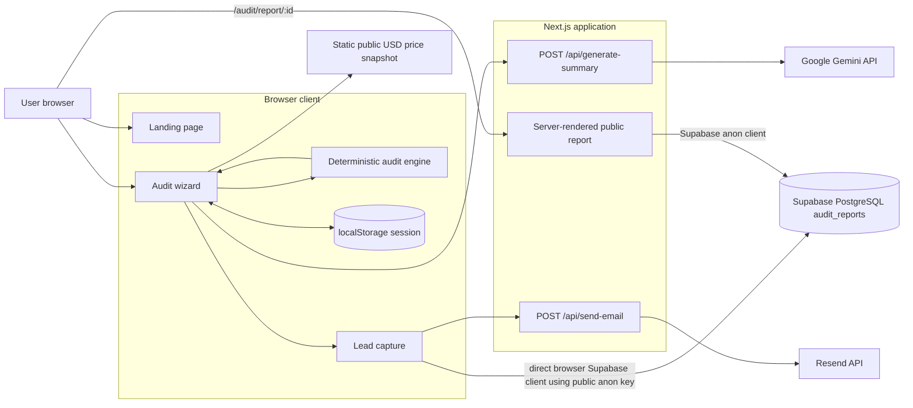
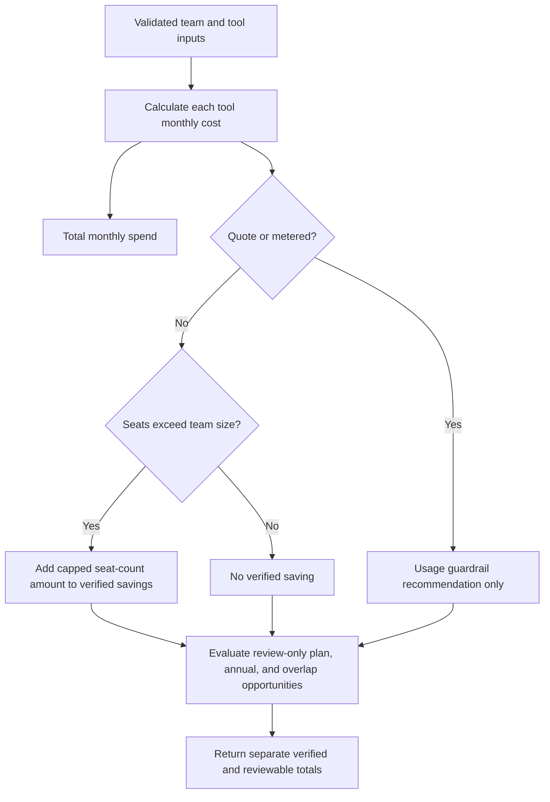
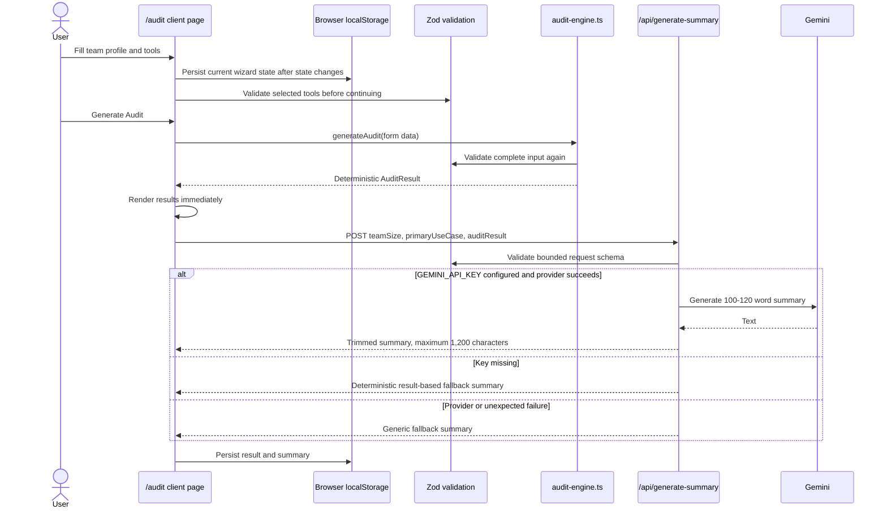
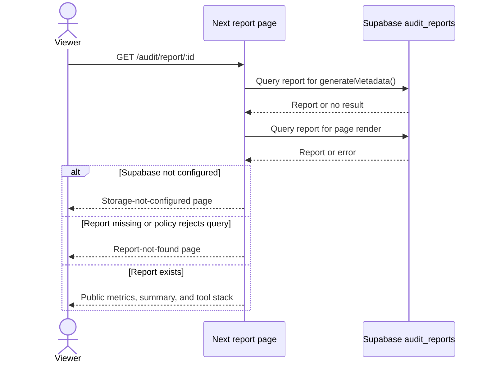

# TokenGuard Architecture

> **Canonical architecture reference.** This document describes the code that is in this repository as inspected on 2026-07-21. When an older product document, landing-page claim, or screenshot conflicts with the source, the source code wins.

**Companion documentation:** [audit methodology](audit-methodology.md) for the rules and evidence model and [operations guide](operations.md) for setup, deployment, and security.

## 1. The 30-second explanation

TokenGuard is a Next.js 16 web application that helps a team estimate its current AI-tool subscription spend and surface cost-reduction *review targets*. A user completes a client-side wizard, then a deterministic TypeScript rules engine calculates spend and recommendations from a code-maintained price snapshot plus optional invoice subtotals.

The financial logic does **not** use an LLM. Gemini is called only after the deterministic result exists, to turn that result into a short executive summary. A user may save the result directly to Supabase from the browser, receive a Resend email, and open a public report URL rendered by a server component.

The key scope boundary is that this is a **point-in-time audit estimator**, not a predictive ML system, a live billing integration, or an automated purchasing system. Its annual spend figure is a monthly run rate multiplied by 12.

## 2. Product boundary: what the app does and does not do

| In scope today | Explicitly out of scope today |
| --- | --- |
| Accepts team size, a primary use case, tool/plan/seat selections, and optional invoice subtotals | Connect to vendor billing, SSO, seat rosters, or usage APIs |
| Calculates current monthly and annualized spend from a static USD price catalog or an entered invoice | Forecast future usage, future prices, renewal likelihood, churn, or budget variance |
| Flags deterministic seat-count excess and marks other reductions as review-only | Automatically cancel seats, change plans, negotiate contracts, or route production requests between models |
| Creates an LLM-written explanation of already-calculated results | Let an LLM decide pricing math or savings recommendations |
| Saves a public, shareable audit report | Provide authentication, private workspaces, report expiry, or historical comparisons |

This boundary is intentional. Cost recommendations become easier to explain and test when the calculation is deterministic; the LLM remains a presentation layer rather than a source of financial truth.

## 3. System context



Two design details are easy to miss:

- The audit engine and price catalog are shipped to the browser because the audit page is a client component. There is no server-side audit-calculation endpoint.
- Saving a report is a **direct browser-to-Supabase insert**, not a request to a Next.js save-report route. The Supabase Row Level Security (RLS) policy is therefore a primary security boundary.

## 4. Runtime routes and rendering model

The repository uses the Next.js App Router. Files without `"use client"` are Server Components by default; interactive components are client boundaries.

| URL / handler | Source | Render / execution location | Responsibility |
| --- | --- | --- | --- |
| `/` | `app/page.tsx` | Server Component shell with nested client components | Composes the marketing page. It does not fetch app data. |
| `/audit` | `app/audit/page.tsx` | Client Component | Owns wizard state, local persistence, deterministic audit generation, and summary request. |
| `/audit/report/[id]` | `app/audit/report/[id]/page.tsx` | Async Server Component | Loads one public report from Supabase, produces metadata, and renders the public view. `params` is awaited because it is a Promise in this Next version. |
| `POST /api/generate-summary` | `app/api/generate-summary/route.ts` | Server Route Handler | Validates a result payload and calls Gemini, or returns a fallback summary. |
| `POST /api/send-email` | `app/api/send-email/route.ts` | Server Route Handler | Validates email/report data and sends a report-link email through Resend. |

There are no route handlers for pricing, audit calculation, authentication, report creation, analytics, or webhooks. The `next.config.ts` file is currently empty, so the code does not set custom runtime, cache, image, security-header, or redirect behavior.

### 4.1 UI composition

```text
app/layout.tsx                       Root HTML, Inter font, global CSS, metadata
└── app/page.tsx                     Marketing-page composition
    ├── Navbar                       Client animation + link to /audit
    ├── HeroSection                  Server component containing FadeIn client islands
    ├── PlatformsSection             Client animated platform grid
    ├── HowItWorks                   Client animated explanation cards
    ├── CTAFooter                    Client animated call to action
    └── BackgroundEffects            Static visual layer

app/audit/page.tsx                  One client-side audit state machine
├── StepIndicator                    Visual progress; part of the client graph
├── TeamProfileStep                  Team size + primary use case
├── ToolSelectionStep                Tool, plan, invoice subtotal, seats
├── ReviewStep                       Reuses monthlyCost before calculation
└── AuditResults
    └── LeadCapture                  Supabase insert + email request

app/audit/report/[id]/page.tsx      Public server-rendered report
```

The `components/ui/` directory contains local shadcn/Radix-style primitives. `Button` and `Card` are used by the product UI; the directory is a reusable UI layer rather than an API boundary.

### 4.2 Module ownership map

| Area | Key files | Role |
| --- | --- | --- |
| Domain types | `types/audit.ts` | Defines audit input, result, recommendation, confidence, and primary-use-case types. |
| Price catalog | `lib/pricing-data.ts` | Static public USD plans, source URLs, plan tiers, and quote-plan markers. This is the runtime price source of truth. |
| Validation | `lib/audit-validation.ts` | Zod schemas for draft tools, valid audit inputs, audit results, persisted sessions, and summary inputs. |
| Rules engine | `lib/audit-engine.ts` | `monthlyCost()` and `generateAudit()`; no network or LLM dependency. |
| Persistence adapter | `lib/supabase.ts` | Creates one Supabase client from public URL/anon-key environment variables and exposes configuration status. |
| Summary integration | `app/api/generate-summary/route.ts` | Server-only Gemini SDK use and deterministic/text fallback behavior. |
| Email integration | `app/api/send-email/route.ts` | Server-only Resend SDK use. |
| Shared presentation | `components/audit/*` | Collects inputs, explains results, saves report. |

`lib/audit.ts` is only a compatibility re-export of types. `openai`, `react-hook-form`, and related dependencies are installed, but the application source does not currently use OpenAI or React Hook Form for this workflow.

## 5. Core data contracts

### 5.1 Audit request

The app keeps this shape in React state and sends a subset of it to the summary endpoint:

```ts
type PrimaryUseCase =
  | "Coding"
  | "Writing"
  | "Research"
  | "Data Analysis"
  | "Mixed Workloads";

interface AuditToolInput {
  toolId: string;
  planId: string;
  seats: number;
  monthlySpend?: number; // Recent invoice subtotal; optional for public plans.
}

interface AuditFormData {
  teamSize: number;
  primaryUseCase: PrimaryUseCase;
  tools: AuditToolInput[];
}
```

`toolId` and `planId` are IDs, not display names. They are resolved against `pricingData` at runtime. The catalog currently accepts these tool IDs:

| Tool ID | Product label | Pricing mode |
| --- | --- | --- |
| `cursor` | Cursor | Static self-serve plans plus quote-based Enterprise |
| `copilot` | GitHub Copilot | Static self-serve/team/enterprise plan prices |
| `claude` | Claude | Static self-serve/team plan prices |
| `chatgpt` | ChatGPT | Static plans including monthly and annual-billing Business |
| `gemini` | Google AI / Gemini | Static individual plan prices |
| `notion-ai` | Notion AI | Business workspace price with AI included; bundled invoice scope needs care |
| `midjourney` | Midjourney | Paid-account plans with monthly and annual-billing equivalents |
| `perplexity` | Perplexity | Static individual and enterprise subscription prices; API usage is separate |
| `canva` | Canva AI | Base annual-plan equivalents; AI allowances and add-ons are invoice-sensitive |
| `other` | Other AI / API invoice | Invoice required; no public unit-price calculation |

OpenAI API, Anthropic API, Windsurf, and other unsupported vendors are **not individual tool IDs in the audit form**. They must currently be entered through the generic `other` invoice option.

### 5.2 Validation boundaries

Zod is used at several boundaries. The schemas do not replace server-side authorization or database policy.

| Boundary | What is enforced | Important nuance |
| --- | --- | --- |
| Wizard tool selection | A supported tool, a plan belonging to that tool, integer seats 1–100,000, finite invoice subtotal 0–$10M | A quote/metered plan requires a truthy invoice amount, so an entered `0` is not sufficient. |
| Final audit input | Team size 1–100,000, one of five use cases, 1–50 valid tools | `generateAudit()` repeats this validation rather than trusting the UI. |
| Stored browser session | Bounded fields and a shape-safe result | Session restoration allows a *draft* tool shape; it does not prove that an old tool/plan is still current. |
| Summary API | Team size, use case, and the complete `AuditResult` schema | The endpoint validates the caller's reported result but does not recompute it server-side. |
| Email API | Valid email, finite monthly savings, 8–120 character report ID matching `[A-Za-z0-9_-]+` | It does not check report ownership or that the report ID exists. |

If `generateAudit()` receives invalid data, it returns zero totals and one high-priority, review-only recommendation asking the user to correct input. It does not throw an exception into the UI.

### 5.3 Audit result

```ts
interface AuditRecommendation {
  tool: string;
  severity: "low" | "medium" | "high";
  confidence: "verified" | "review";
  title: string;
  description: string;
  action: string;
  estimatedSavings: number;
}

interface AuditResult {
  totalMonthlySpend: number;
  estimatedAnnualSpend: number;
  estimatedMonthlySavings: number;
  reviewableMonthlySavings: number;
  recommendations: AuditRecommendation[];
}
```

`estimatedMonthlySavings` is shown as **verified monthly savings** in the UI. In code, this means a savings amount produced by the seat-count rule using user-supplied counts—not independent verification against a vendor roster. `reviewableMonthlySavings` is deliberately shown separately and is never added to the verified total.

## 6. Pricing architecture and spend calculation

### 6.1 Price source model

`lib/pricing-data.ts` is a static, typed catalog of public USD self-serve list prices. Each plan has:

- an ID and display name;
- a monthly price;
- a billing cadence (`monthly` or `annual`);
- a broad tier (`free`, `individual`, `team`, or `premium`);
- a short `bestFor` description; and
- an optional billing unit (`seat` or paid `account`), downgrade-target guard, and explicit annual-plan mapping; and
- optional `requiresQuote` for plans where the app must use an invoice subtotal.

The code labels the snapshot as last reviewed **2026-07-21**, excludes taxes and potential usage overages, and links to vendor pages from the UI. It does **not** fetch live pricing at runtime, scrape vendors, retain price-history records, or perform currency conversion. A saved report retains tool IDs, plan IDs, seats, and an optional invoice—not the exact catalog price/version used to generate it.

That last point matters: after a catalog edit, a historical public report can display a different derived per-tool monthly cost for a no-invoice plan. The report headline totals remain values saved at creation time, while its tool-stack cost uses the current `monthlyCost()` implementation.

### 6.2 Monthly cost formula

For each selected tool, the engine calculates:

```text
monthlyCost(tool) =
  entered invoice subtotal,       if it is present and > 0
  public plan price × quantity,   otherwise, for a known non-quote plan
  0,                              otherwise
```

The value is clamped to non-negative numbers. An entered invoice intentionally overrides list price, including a discounted invoice. An explicit `0` does not override a priced plan because the code treats only values greater than zero as an entered invoice. Quote/metered plans therefore require a positive invoice subtotal to pass final validation.

```text
totalMonthlySpend     = Σ monthlyCost(tool)
estimatedAnnualSpend  = round(totalMonthlySpend × 12)
```

Amounts are rounded to cents before the result is returned. This is an annualized run rate, not a time-series forecast.

### 6.3 Deterministic recommendation rules

The following table is the exact decision vocabulary currently implemented. It is useful for explaining why a result changes when inputs change.

| Trigger | Confidence | Saving calculation | Action / caveat |
| --- | --- | --- | --- |
| Invalid audit input | Review | $0 | Return a safe correction request instead of calculating. |
| Quote or metered plan with invoice | Review | $0 | Recommends budgets, tags, model routing, context limits, caching, or batch processing; no reduction is guessed. |
| Paid seats or paid accounts exceed declared team size | Verified | `min(tool spend, (seats - teamSize) × plan price)` | The only amount included in `estimatedMonthlySavings`. It is an entitlement-count check, not proof that an entitlement is inactive. |
| Selected plan has `premium` tier | Review | `min(tool spend, (current list price - cheapest individual/team price) × seats)` | Flags a potential downgrade only after feature, utilization, compliance, and governance review. |
| `team` tier and declared team size ≤ 2 | Review | Same plan-price-difference approach | Suggests checking whether team administration / centralized billing is actually required. |
| Annual-billing alternative is cheaper | Review | `min(tool spend, (monthly price - annual-equivalent price) × quantity)` | Uses an explicit same-plan mapping where a vendor has several plans in one tier; contract commitment must be checked. |
| Entered invoice exceeds public base list cost | Review | $0 | Flags possible overages, add-ons, tax, credit, or regional-pricing investigation. |
| Both Cursor and Copilot selected | Review | Smaller of the two tool monthly costs | A maximum overlap-review target; both tools may be intentional. |
| More than one paid general-assistant entry selected for Writing, Research, Data Analysis, or Mixed Workloads | Review | Smaller tool monthly cost in the group | The current deliberate group is ChatGPT, Claude, Gemini, and Perplexity; it requires workflow and data-control validation before consolidation. |
| No rule fires | Review | $0 | Returns an honest "no safe automatic reduction identified" recommendation. |

### 6.4 Savings semantics and a common reporting trap



Do **not** add `estimatedMonthlySavings` and `reviewableMonthlySavings` together. Review opportunities can overlap one another—for example, an annual-billing review and a downgrade review may refer to the same seats—and the engine intentionally does not deduplicate them. Reviewable savings are a gross investigation queue, not a financially defensible combined forecast.

The primary use case has a deliberately limited role today: it gates only the multi-general-assistant overlap rule. It does not change pricing, seat math, premium-plan logic, or any model-quality score.

## 7. End-to-end data flows

### 7.1 Audit creation and AI summary



The UI sets `auditResult` before waiting for Gemini. It can therefore display the deterministic result while the summary is blank or still loading. The client does not expose a separate summary-error state. If the route returns an invalid-request error rather than JSON with `summary`, the UI has no explicit recovery message.

Saving is also possible during that window. `LeadCapture` persists the `summary` prop as it exists when the user clicks Save; there is no later database update when Gemini finishes. A fast save can therefore create a public report with an empty `ai_summary` even though the browser later receives one.

### 7.2 Browser-session persistence

The audit page stores this complete session under `tokenguard-audit-session`:

```text
currentStep, teamSize, primaryUseCase, tools, auditResult, aiSummary
```

On load it parses JSON, runs `auditSessionSchema.safeParse`, and deletes malformed sessions. It defers state restoration with `setTimeout(..., 0)` inside the effect. Every subsequent relevant state change overwrites the browser record; “Start New Audit” removes it.

This improves completion after a refresh but is not durable storage, is not encrypted, is shared by anyone using that browser profile, and can become stale when price data changes. No email, company, or role is added to localStorage by the current flow.

### 7.3 Save and delivery flow

```mermaid
sequenceDiagram
  actor User
  participant L as LeadCapture client component
  participant DB as Supabase audit_reports
  participant M as /api/send-email
  participant R as Resend

  User->>L: Enter email and optional company / role
  L->>L: Trim/lowercase email; reject filled honeypot
  L->>DB: Direct insert via anon Supabase client
  DB-->>L: New report id
  L->>M: POST email, verified-monthly-savings, report id
  alt RESEND_API_KEY configured and request succeeds
    M->>R: Send transactional email with public report URL
    R-->>M: Provider response
    M-->>L: success
  else Delivery unavailable or fails
    M-->>L: non-OK response
    L->>L: Show saved report with delivery warning
  end
  L-->>User: Link to /audit/report/:id
```

The database insert occurs before the email request. Therefore a Resend failure does not roll back a saved report. Conversely, an insert error prevents email delivery and displays a generic Supabase-permissions/schema error.

### 7.4 Public report and metadata flow



`generateMetadata()` and the page each issue their own `.select("*").eq("id", id).single()` query in application code. There is no application-level request deduplication or explicit cache configuration. A public report displays saved monthly spend, annual spend, verified monthly savings, AI summary, and tool details. It does **not** render email, company, or role, but those values remain in the database.

## 8. External integration contracts

| Integration | Direction | Data sent / read | Failure behavior | Secret / access model |
| --- | --- | --- | --- | --- |
| Supabase | Browser → database for insert; server component → database for read | Insert includes email, optional company/role, team size, use case, tools, saved totals, summary. Read uses all report columns. | Saving shows an error; public page shows configuration or not-found state. | `NEXT_PUBLIC_SUPABASE_URL` and `NEXT_PUBLIC_SUPABASE_ANON_KEY` are intentionally exposed to the browser. RLS must enforce permitted actions. |
| Google Gemini | Next route handler → provider | Team size, primary use case, aggregate totals, and recommendation text/actions. No email/company/role/raw tool list is sent by this route. | Result-based fallback if key is missing; generic fallback on other exception. | `GEMINI_API_KEY` stays server-side. |
| Resend | Next route handler → provider | Recipient email, verified monthly savings, and public report URL. | Route returns 503 for missing key, 400 for invalid input, 500 for provider/other errors. UI preserves saved report and warns on non-OK response. | `RESEND_API_KEY` stays server-side; optional sender address is server-side. |
| Vendor pricing pages | Browser → vendor only when user clicks link | No audit input is sent by TokenGuard as part of the link. | No effect on calculation; catalog is already bundled. | No vendor API key. |

### 8.1 Required environment variables

| Variable | Required for | Behavior if absent |
| --- | --- | --- |
| `NEXT_PUBLIC_SUPABASE_URL` | Report saving and public report loading | `isSupabaseConfigured` is false; save is blocked in the UI and report page shows a configuration message. |
| `NEXT_PUBLIC_SUPABASE_ANON_KEY` | Same as above | Same behavior. The code creates a placeholder client to avoid a build-time crash, but functionality is gated. |
| `GEMINI_API_KEY` | Provider-generated executive summary | `/api/generate-summary` returns a deterministic fallback summary. |
| `RESEND_API_KEY` | Transactional email | `/api/send-email` returns 503; a successfully saved report remains viewable. |
| `RESEND_FROM_EMAIL` | Verified/from address | Defaults to `TokenGuard <onboarding@resend.dev>`. |
| `NEXT_PUBLIC_APP_URL` | Stable email report URL base | Route falls back to the incoming request `Origin`, then `http://localhost:3000`. Set this explicitly in production. |

## 9. Supabase persistence model

There are no Supabase migrations, generated database types, or RLS policy files committed in this repository. The following is the **minimum inferred contract** from the insert and query code, not a claimed complete production schema.

| `audit_reports` field | Expected use | Publicly rendered? |
| --- | --- | --- |
| `id` | Database-generated report identifier; used in URL and email route | Yes, as part of the URL only |
| `email` | Lead contact and Resend recipient | No |
| `company` | Optional lead context | No |
| `role` | Optional lead context | No |
| `team_size` | Saved audit input | No |
| `primary_use_case` | Saved audit input | No |
| `tools` | Array/JSON audit inputs | Partially: tool name/plan, seat count, and derived monthly cost |
| `monthly_spend` | Saved aggregate result | Yes |
| `monthly_savings` | Saved verified savings | Yes |
| `annual_spend` | Saved annualized result | Yes |
| `ai_summary` | Saved executive narrative | Yes |

At minimum, the database must generate `id`, accept the listed types, allow anonymous inserts from the browser, and allow the anonymous client to select a report by ID for public rendering. Exact SQL types, constraints, indexes, retention, and RLS policies must be verified in the Supabase project because they are not versioned here.

The insert does **not** persist recommendations, `reviewableMonthlySavings`, the full audit-engine output, a price catalog version, or email-delivery status. A public report is therefore a shareable summary of selected totals and tools, not an immutable or complete audit record.

## 10. Trust boundaries, privacy, and current risks

### 10.1 Data classification

| Data category | Examples | Where it lives / travels |
| --- | --- | --- |
| Audit data | Team size, use case, tool/plan IDs, seats, invoice subtotal, totals, recommendations | Browser state and localStorage; Supabase if saved; aggregate recommendation context to Gemini |
| Contact data | Email, optional company, optional role | Browser form; Supabase if saved; email goes to Resend. It is not sent to Gemini by the implemented route. |
| Public report data | Totals, summary, tool plans, seat counts, derived monthly costs | Rendered to anyone who knows/guesses a report URL; public metadata includes annualized verified savings. |
| Server secrets | Gemini key, Resend key, sender configuration | Server route-handler environment only |
| Public integration configuration | Supabase URL and anon key | Delivered to browser by design; must be paired with correct RLS |

### 10.2 Existing safeguards

- Numeric and shape validation is applied to audit inputs, API payloads, and restored local state.
- Gemini and Resend secrets are used only inside server route handlers.
- The public report component does not render email, company, or role.
- React rendering escapes report text by default; the application does not inject the AI summary as raw HTML.
- The lead form normalizes email and contains a hidden website honeypot field.
- The email route URL-encodes the report ID when constructing a link.

### 10.3 Gaps to explain candidly

| Gap | Why it matters | Production-grade direction |
| --- | --- | --- |
| Direct anonymous database insert | A browser can bypass the UI and call the public Supabase endpoint if RLS permits it. Client-side validation is not authorization. | Move report creation to a server route or server action; authenticate or issue signed anonymous session tokens; enforce tightly scoped RLS. |
| RLS policies not in repository | The effective security model cannot be code-reviewed or reproduced locally. | Commit migrations and policy tests; use generated Supabase types. |
| Public report URL is the only access mechanism | Anyone with a URL can see financial totals, tool stack, seat count, and summary. IDs reduce accidental discovery but do not provide authorization. | Add privacy choice, unguessable/signed tokens, expiry/revocation, and private authenticated reports. |
| Honeypot is client-only | A bot can skip the UI, especially because report insert bypasses a server endpoint. | Add server-side rate limits, bot checks, abuse monitoring, and database quotas. |
| Unauthenticated Gemini endpoint | Any caller that satisfies the schema can consume provider quota with an arbitrary result payload. | Rate-limit by IP/session, recompute results server-side, add abuse monitoring and quotas. |
| Unauthenticated email endpoint | A caller can ask the endpoint to email an arbitrary valid address and syntactically valid report ID; the route does not verify ownership or existence. | Authorize report delivery, rate-limit, verify report existence/recipient, and queue sends. |
| Summary-save race | A report can be saved before the asynchronous summary request completes and will keep the then-current, possibly empty summary. | Disable save until a summary/fallback exists, or persist/update summary server-side with a report version. |
| Request-origin fallback for report links | If `NEXT_PUBLIC_APP_URL` is unset, the email handler uses the request `Origin`, which should not be trusted as deployment configuration. | Set and validate a canonical HTTPS application URL in every environment. |
| No persisted price snapshot | Historic report tool costs can drift after catalog edits, while saved totals do not. | Persist a catalog version, plan price, currency, invoice basis, and full result snapshot per report. |
| No live usage source | "Verified" saving is based on declared team size/seats, not external activity data. | Integrate vendor/admin exports, reconcile roster IDs, and record evidence timestamps. |
| No telemetry, audit log, or retry queue | Failures and cost impact cannot be measured reliably; email delivery has no retry. | Emit structured events, use observability, and move delivery to an idempotent queue. |

## 11. Failure modes and graceful degradation

| Scenario | What the user sees | What still works |
| --- | --- | --- |
| Malformed browser session | Bad localStorage entry is deleted | User can start a new audit. |
| Invalid form data reaches engine | Zero totals plus a correction recommendation | No financial recommendation is fabricated. |
| Gemini key missing | Result-based fallback summary | Full deterministic audit and report save still work. |
| Gemini/provider request fails | Generic summary fallback | Full deterministic audit and report save still work. |
| Supabase configuration absent | Save form states that storage is not configured; report route shows configuration page | Local audit and summary work. |
| Supabase insert fails | Lead capture displays a save error | Audit remains in browser session. |
| Resend configuration absent/fails after save | Saved report succeeds with delivery warning | Shareable link works if Supabase succeeded. |
| Report missing or RLS read rejected | Generic “Report not found” page | No report data is disclosed. |

The generic Gemini-error fallback claims that there are “several opportunities,” even when a deterministic result may show zero savings. This is a presentation inconsistency worth correcting before relying on the text in a real financial conversation.

## 12. Design choices and trade-offs

### Deterministic engine in the client

**Why:** Results are immediate, explainable, and easy to reproduce from one input object. The product avoids sending financial decisions to a generative model.

**Trade-off:** The browser owns calculation and can be manipulated. A saved report is not server-authoritative. Moving the same pure engine to a server route would preserve determinism while strengthening integrity.

### Static price catalog rather than live pricing integration

**Why:** It keeps the MVP simple, transparent, and independent of vendor APIs/scrapers.

**Trade-off:** Freshness is a manual operational responsibility. It cannot model negotiated terms, taxes, regional prices, usage overages, or future price changes without an entered invoice.

### Two savings confidence levels

**Why:** It separates a narrow, reproducible seat-count calculation from business decisions that need human validation.

**Trade-off:** The label “verified” can be misunderstood. It is verified *by rule and supplied count*, not independently verified against the vendor.

### Supabase direct from the browser

**Why:** Removes a custom CRUD API and makes the no-login flow fast to ship.

**Trade-off:** RLS becomes critical and cannot be treated as optional configuration. It also makes rate limiting and abuse prevention harder than a server-owned write path.

### LLM only for summary writing

**Why:** Gemini improves readability without influencing pricing or savings math. A constrained input, prompt instructions, and output-length cap reduce—but do not eliminate—hallucination risk.

**Trade-off:** The narrative can still be inconsistent with the displayed result on provider failure. It needs automated content checks or deterministic templating for high-stakes use.

### Public reports without authentication

**Why:** A shareable link lowers friction and makes a result easy to send to a founder or finance stakeholder.

**Trade-off:** The report itself contains potentially sensitive operational-finance information. Privacy controls and revocation are needed for wider adoption.

## 13. Recommended evolution path

The following sequence preserves the strongest current idea—deterministic, explainable cost analysis—while making it dependable in production.

### Phase 1: establish data integrity and safety

1. Move report creation and audit calculation behind a server-owned endpoint; validate input and recompute the result there.
2. Commit Supabase migrations, generated types, and least-privilege RLS policies; avoid broad anonymous `select`/`insert` access.
3. Add rate limits and abuse controls to summary, report creation, and email endpoints.
4. Make public/private report sharing an explicit user choice; add expiration and revocation.
5. Persist an immutable audit snapshot: price catalog version, plan price, currency, raw invoice basis, engine version, result, and recommendation evidence.

### Phase 2: improve financial accuracy

1. Collect vendor admin exports or billing API data with user consent.
2. Reconcile billed seats, assigned seats, and active users rather than using only declared team size.
3. Capture currency, tax, region, contract term, renewal date, credits, and usage/overage fields.
4. Model API spend by workload, token/compute unit, model, request volume, cache hit rate, and batch eligibility.
5. Deduplicate mutually exclusive review opportunities before presenting a combined potential range.

### Phase 3: add genuine forecasting and operations

1. Store dated cost/usage observations and forecast a range with confidence intervals, not one unqualified number.
2. Compare actual spend to budget and forecast; alert on variance and renewal deadlines.
3. Add workflow-specific policy recommendations backed by observed quality and usage metrics.
4. Queue email/report jobs with idempotency keys, retries, and delivery webhooks.
5. Instrument audit start/completion/save/view/conversion events and monitor rule outcomes.

At that point it would be fair to call TokenGuard a predictive FinOps product. The current code should be described as an explainable audit calculator with advisory recommendations.

## 14. Key architectural decisions

| Decision | Current implementation and implication |
| --- | --- |
| Financial logic stays deterministic | The audit wizard uses typed price data and invoice inputs to produce repeatable calculations; Gemini only converts the resulting data into prose. |
| Savings have two non-additive confidence buckets | Seat-count savings are narrow and deterministic; broader plan, billing, and consolidation opportunities require review and must not be summed into the verified amount. |
| Reports use a public, low-friction path | Reports are persisted to Supabase and rendered through a dynamic Next.js server route; email is delivered by a separate server handler. This makes RLS, privacy controls, and report revocation essential for production. |
| Pricing is manually maintained | `lib/pricing-data.ts` has source links and review dates, but a production system needs ingestion, monitoring, versioning, and snapshots attached to saved reports. |
| Direct browser persistence is an MVP trade-off | The client inserts reports with an anonymous Supabase key. Replace this with a server-owned write path before handling real customer data. |
| Forecasting is not implemented | The app estimates current monthly run rate and annualizes it by 12; it has no historical data or predictive model. |
| Accuracy depends on operational evidence | Reconcile billed, assigned, and active seats; store contract terms and invoices; ingest API usage; and preserve pricing snapshots. |

### Source-of-truth checklist

- Start with `types/audit.ts`, `lib/audit-validation.ts`, `lib/pricing-data.ts`, and `lib/audit-engine.ts` for the domain and rules.
- Trace `app/audit/page.tsx` for client state/localStorage and `components/audit/lead-capture.tsx` for save behavior.
- Trace the two route handlers for what is actually server-side.
- Trace `app/audit/report/[id]/page.tsx` for what a public link exposes.
- Verify deployment environment variables and actual Supabase policies separately; they are not represented by this repository.

## 15. File guide

| File | Read it when you need to understand |
| --- | --- |
| `app/layout.tsx` | Global HTML, font, and metadata defaults |
| `app/page.tsx` | Marketing-page assembly |
| `app/audit/page.tsx` | Wizard lifecycle, local session persistence, audit/summary orchestration |
| `components/audit/team-profile-step.tsx` | Team/use-case input UI |
| `components/audit/tool-selection-step.tsx` | Plan selection, invoice entry, UI-level validation |
| `components/audit/review-step.tsx` | Pre-audit spend preview |
| `components/audit/audit-results.tsx` | Savings labels, recommendation rendering, source disclosure |
| `components/audit/lead-capture.tsx` | Browser-side report persistence and email trigger |
| `lib/pricing-data.ts` | Price snapshot, plan taxonomy, vendor source links |
| `lib/audit-validation.ts` | Zod constraints and session/API schemas |
| `lib/audit-engine.ts` | Cost function and recommendation rules |
| `lib/supabase.ts` | Public Supabase client/configuration guard |
| `app/api/generate-summary/route.ts` | Gemini prompt boundary and fallback behavior |
| `app/api/send-email/route.ts` | Resend delivery boundary and link construction |
| `app/audit/report/[id]/page.tsx` | Public report query, metadata, and exposure surface |

## 16. Architecture review status

The repository has a sound MVP separation between deterministic calculations and generative presentation. Its highest-value production work is not another UI feature: it is server-authoritative calculation/persistence, versioned price evidence, vendor-data reconciliation, explicit privacy controls, reproducible database policy, abuse protection, and observability.

Those changes would turn the current explainable calculator into a dependable operational-finance system without losing its strongest design decision: never let an LLM invent the money math.
